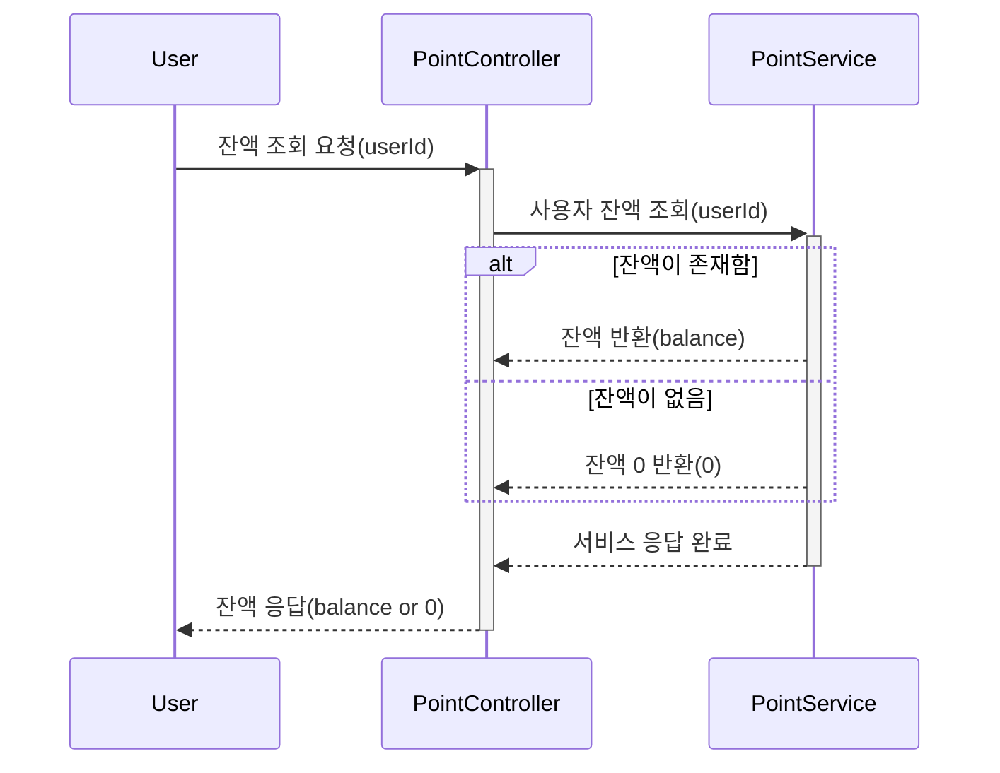
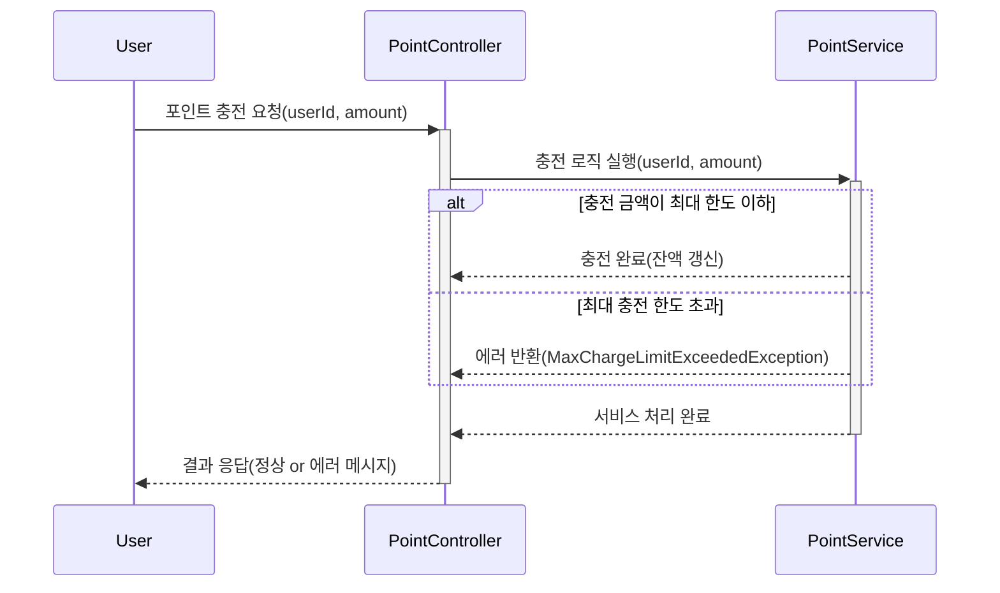
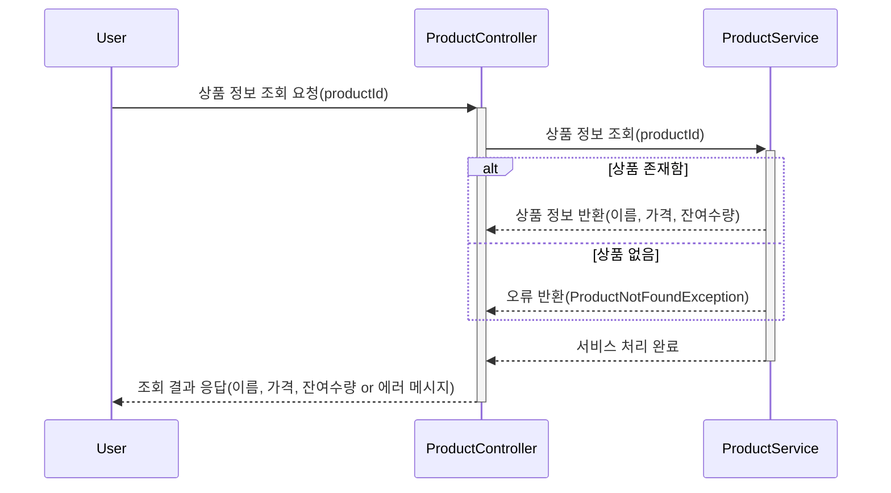
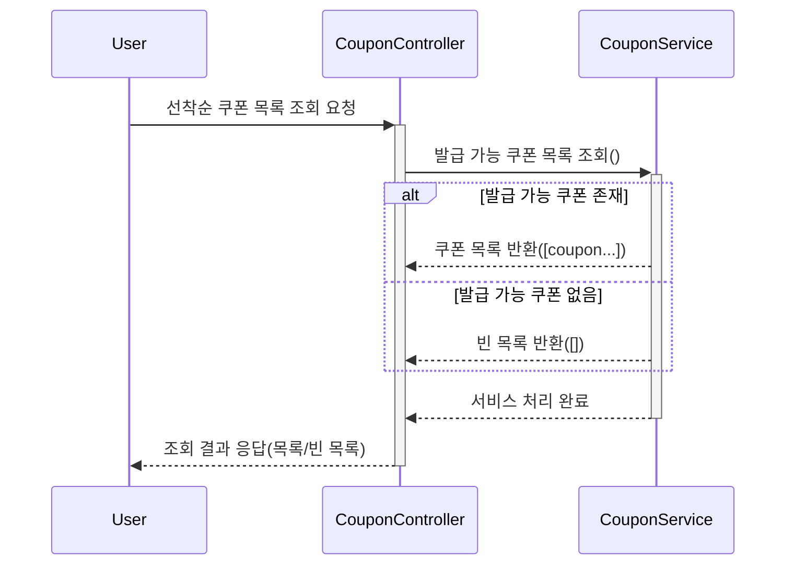
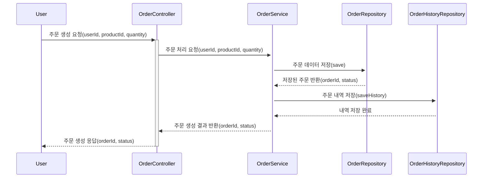
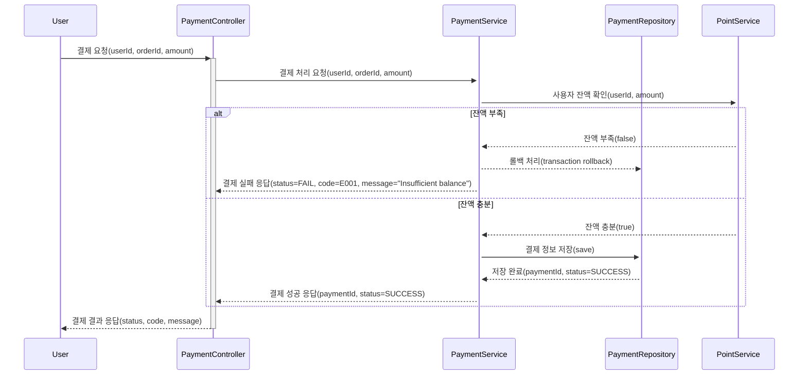

# 시퀀스 다이어그램 문서

> 이커머스 플랫폼의 핵심 비즈니스 로직 흐름을 시각화한 문서입니다.

## 📑 목차

- [1. 개요](#1-개요)
- [2. 포인트 관리](#2-포인트-관리)
  - [2.1 잔액 조회](#21-잔액-조회)
  - [2.2 잔액 충전](#22-잔액-충전)
- [3. 상품 관리](#3-상품-관리)
  - [3.1 상품 조회](#31-상품-조회)
- [4. 쿠폰 관리](#4-쿠폰-관리)
  - [4.1 선착순 쿠폰 목록 조회](#41-선착순-쿠폰-목록-조회)
- [5. 주문 관리](#5-주문-관리)
  - [5.1 주문 생성](#51-주문-생성)
- [6. 결제 관리](#6-결제-관리)
  - [6.1 결제 처리](#61-결제-처리)

---

## 1. 개요

본 문서는 이커머스 시스템의 주요 API 엔드포인트에 대한 시퀀스 다이어그램을 제공합니다. 각 다이어그램은 클라이언트 요청부터 응답까지의 전체 흐름과 컴포넌트 간 상호작용을 보여줍니다.

### 문서 구성

- **시퀀스 다이어그램**: Mermaid 형식으로 작성된 플로우 차트
- **API 설명**: 각 엔드포인트의 목적과 역할
- **주요 로직**: 핵심 비즈니스 로직 및 검증 규칙
- **예외 처리**: 발생 가능한 오류 상황 및 처리 방법
- **입출력 명세**: 요청/응답 파라미터 정보

---

## 2. 포인트 관리

사용자의 포인트 잔액을 관리하는 기능들입니다. 포인트는 결제 시 사용되며, 충전을 통해 증액할 수 있습니다.

### 2.1 잔액 조회

---

### 2.2 잔액 충전

#### 시퀀스 다이어그램

---

## 3. 상품 관리

---

## 4. 쿠폰 관리

---

## 5. 주문 관리

사용자의 상품 주문 생성 및 관리 기능입니다.

### 5.1 주문 생성

---

## 6. 결제 관리

---
